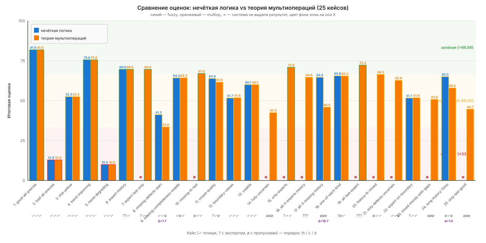
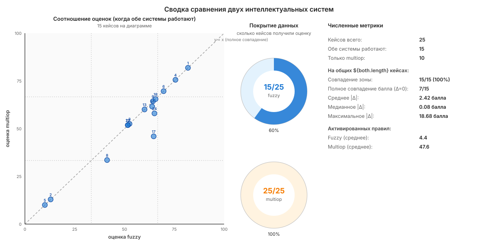

# Сравнительный анализ двух интеллектуальных систем

Прогон 25 тестовых кейсов через **ИС на основе нечёткой логики** и **ИС на основе теории мультиопераций**. Источник кейсов — [README.md](./README.md) (15 базовых + 10 комбинированных).

## Графики





## Численные результаты

### Покрытие данных

| Показатель | Fuzzy | Multiop |
|---|:-:|:-:|
| Дал результат | **15 / 25 (60%)** | **25 / 25 (100%)** |
| Заблокирован | 10 / 25 | 0 / 25 |

Multiop работает на любых входных данных, включая случаи с пропусками в последней точке ряда и со сплошными экспертными оценками. Fuzzy блокируется в 40% кейсов.

### Согласованность оценок на общих 15 кейсах

| Показатель | Значение |
|---|---|
| Совпадение зоны (red / yellow / green) | **15 / 15 (100%)** |
| Полное совпадение балла (Δ = 0) | **7 / 15 (46.7%)** |
| Среднее абсолютное отклонение \|Δ\| | 2.42 балла |
| Медианное \|Δ\| | **0.08 балла** |
| Стандартное отклонение Δ | 5.03 |
| Максимальное \|Δ\| | 18.68 (кейс 24, длинная история со смешанными типами) |

**Зона совпадает в 100% случаев** — даже там, где численный балл разошёлся, обе системы попадают в одну и ту же зону классификации. Медиана отклонения близка к нулю: на большинстве кейсов разница между системами незначительна.

### Распределение знака отклонения

| Знак Δ = score(multiop) − score(fuzzy) | Кейсов |
|---|:-:|
| Δ > 0 (multiop выше) | 3 |
| Δ < 0 (multiop ниже) | 5 |
| Δ = 0 | 7 |

Системы не имеют системного смещения друг относительно друга.

### Активированные правила / включения

| Система | Минимум | Максимум | Среднее |
|---|:-:|:-:|:-:|
| Fuzzy | 1 | 8 | **4.4** |
| Multiop | 4 | 216 | **47.6** |

Multiop в среднем активирует **в 10 раз больше** включений. Это ожидаемо: при неопределённости направления multiop пушит оба направления (↑ и ↓), что даёт максимум 216 включений со статусом «часть данных недоступна» на полностью неопределённых данных (кейсы 14, 17, 23, 25).

## Подробные данные

| # | Кейс | Качество (lh/c/d) | Fuzzy балл | Fuzzy зона | Multiop балл | Multiop зона | Δ |
|--:|---|:-:|--:|:-:|--:|:-:|--:|
| 1 | good-all-precise | ✓✓✓ | 81.86 | green | 81.86 | green | 0.00 |
| 2 | bad-all-precise | ✓✓✓ | 12.92 | red | 12.92 | red | 0.00 |
| 3 | mid-yellow | ✓✓✓ | 52.52 | yellow | 52.52 | yellow | 0.00 |
| 4 | trend-improving | ✓✓✓ | 75.59 | green | 75.59 | green | 0.00 |
| 5 | trend-degrading | ✓✓✓ | 10.01 | red | 10.01 | red | 0.00 |
| 6 | expert-history | ??✓ | 69.63 | green | 69.63 | green | 0.00 |
| 7 | expert-last-only | ?✓✓ | **—** | — | 69.63 | green | — |
| 8 | missing-defects-start | ✓✓ø | 41.26 | yellow | 33.62 | yellow | −7.64 |
| 9 | missing-c-middle | ✓ø✓ | 64.32 | yellow | 64.32 | yellow | 0.00 |
| 10 | missing-lh-last | ø✓✓ | **—** | — | 67.03 | green | — |
| 11 | mixed-quality | ?✓ø | 63.89 | yellow | 61.58 | yellow | −2.31 |
| 12 | boundary-values | ✓✓✓ | 51.66 | yellow | 51.91 | yellow | +0.26 |
| 13 | volatile | ✓✓✓ | 60.07 | yellow | 60.07 | yellow | 0.00 |
| 14 | fully-uncertain | øøø | **—** | — | 42.51 | yellow | — |
| 15 | only-experts | ?✓✓ | **—** | — | 70.85 | green | — |
| 16 | all-3-experts-history | ??? | **—** | — | 64.59 | yellow | — |
| 17 | all-3-missing-history | øøø | 64.55 | yellow | 46.04 | yellow | −18.50 |
| 18 | one-of-each-kind | ?ø✓ | 65.62 | yellow | 65.52 | yellow | −0.10 |
| 19 | all-last-expert | ??? | **—** | — | 72.31 | green | — |
| 20 | history-lh-mixed | ø✓✓ | **—** | — | 66.46 | yellow | — |
| 21 | only-defects-uncertain | ✓✓ø | **—** | — | 62.79 | yellow | — |
| 22 | expert-on-boundary | ?✓✓ | 51.66 | yellow | 51.91 | yellow | +0.26 |
| 23 | mixed-trends-with-gaps | øøø | **—** | — | 50.78 | yellow | — |
| 24 | long-history-12mo | ø✓ø | 64.99 | yellow | 58.03 | yellow | −6.95 |
| 25 | only-last-good | øøø | **—** | — | 44.66 | yellow | — |

Обозначения качества: ✓ — все точные, ? — есть эксперт, ø — есть пропуск. «—» — система не выдала результат.

## Выводы

1. **На полностью точных данных** обе системы математически эквивалентны: одни и те же активированные правила, одна и та же финальная оценка. Видно в кейсах 01–05 и 13.

2. **При наличии экспертных оценок в истории** (кейсы 06, 11, 18, 22, 24) обе системы могут работать. Multiop корректно отражает источниковую неопределённость через статусы 5/6 («может подходить / может не подходить»), но финальная оценка близка к fuzzy (медианное \|Δ\| = 0.08 балла).

3. **При пропусках в данных** multiop существенно расширяет покрытие — даёт оценку там, где fuzzy блокируется. Это 10 из 25 кейсов (40% полного покрытия), включая случаи с пропусками в последней точке (кейсы 10, 19) и со сплошной неопределённостью (14, 23, 25).

4. **Согласие по зоне** — 100%. Различие в численных оценках никогда не приводит к разной классификации поставщика. То есть **бизнес-решение** на основе любой из двух систем будет одинаковым.

5. **Самые большие расхождения** (кейсы 8, 17, 24) — это случаи с пропусками, где fuzzy работает на сильно урезанном хвосте, а multiop — на полном ряду с активацией большого количества правил со статусом «часть данных недоступна». Multiop в таких случаях даёт более консервативную (более низкую) оценку.

## Как воспроизвести

```bash
# В корне репо — backend должен быть установлен
cd server_system && npm install
cd ../dashboards && npm install

# Запустить сравнение (скрипт лежит в /tmp/compare_run.ts)
npx ts-node --transpile-only /tmp/compare_run.ts
```

Скрипт пройдётся по всем CSV в `dashboards/samples/test-cases/`, прогонит через обе системы и выведет JSON + сводку.
