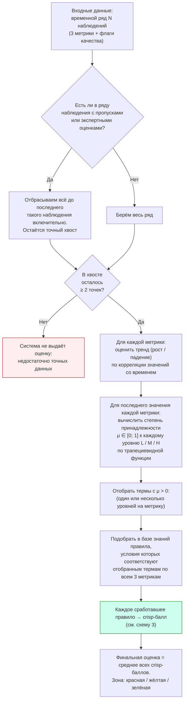
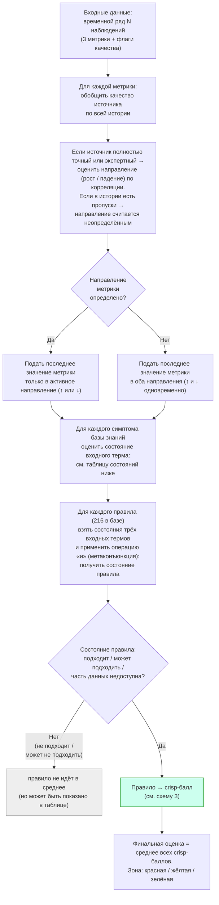
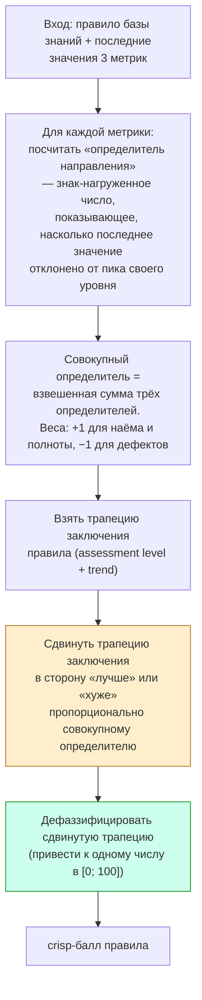
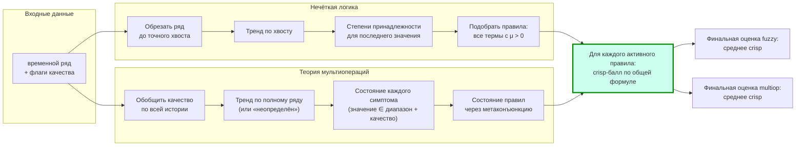

# Блок-схемы математических ядер двух ИС

Mermaid-диаграммы открываются на GitHub. Внизу каждой — формулы операций
с обычной математической нотацией.

---

## 1. Нечёткая логика (Fuzzy)



### Формулы

**Степень принадлежности (трапеция)** для значения `x` и параметров
`[a, b, c, d]`:

```
μ(x) = 0,                       если x ≤ a или x ≥ d
μ(x) = 1,                       если b ≤ x ≤ c    (плато)
μ(x) = (x − a) / (b − a),        если a < x < b
μ(x) = (d − x) / (d − c),        если c < x < d
```

**Корреляция (тренд):**

```
r = Σ(t_i − t̄)(y_i − ȳ)  /  √(Σ(t_i − t̄)² · Σ(y_i − ȳ)²)

тренд = «вверх», если r > −0.2; иначе «вниз»
```

(Порог сдвинут в отрицательную сторону: даже слегка отрицательная
корреляция читается как «вниз».)

---

## 2. Теория мультиопераций (Multiop)



### Состояния входного терма

Каждый симптом сравнивает значение с диапазоном `[start; end]`. Состояние
зависит от качества источника:

| Качество источника | Значение в диапазоне? | Состояние терма |
|---|:-:|:-:|
| Источник не дал данных | — | **0** (не квалифицирован) |
| Точные данные | ✓ | **2** (истинно) |
| Точные данные | ✗ | **1** (ложно) |
| Экспертная оценка | ✓ | **6** (истинно, источник частичный) |
| Экспертная оценка | ✗ | **5** (ложно, источник частичный) |
| Направление неопределено | — | **4** (один из источников недоступен) |

### Метаконъюнкция (операция «и» над состояниями)

Состояние правила = «и» от трёх состояний симптомов. Базовая таблица:

```
                   1 (ложно)   2 (истинно)   4 (неизвестно)
   1 (ложно)        1            1              1
   2 (истинно)      1            2              4
   4 (неизвестно)   1            4              4
```

Для составных состояний {3, 5, 6, 7} применяется обобщение через
множества (каждое состояние представимо как объединение базовых).

---

## 3. Расчёт crisp-балла одного правила (общий блок)

Этот блок одинаков для обеих систем. Различия — только в том, какие
правила в принципе попадают в этот расчёт.



### Формулы

**Определитель направления** (для значения `x` и трапеции `[a, b, _, c]`
по направлению «вверх»):

```
D(x) = (x − b) / (b − a),     если a < x ≤ b   (отрицательно)
D(x) = (x − b) / (c − b),     если b < x < c   (положительно)
D(x) = 0,                     иначе
```

Для «вниз» — зеркально, с компенсирующим сдвигом `−ρ` (для дефектов
`ρ = 0.25`).

**Совокупный определитель:**

```
DA = (ε_lh · D_lh + ε_c · D_c + ε_d · D_d) / 3,
где ε_lh = +1, ε_c = +1, ε_d = −1
```

**Сдвиг трапеции заключения** `[k, l, l, m]` на величину `|DA|` в
сторону цели `target`:

```
target = верхняя граница [m,m,m,m], если знак DA «улучшает» заключение
         нижняя граница  [k,k,k,k], если «ухудшает»

Bp_i = исходное_i + |DA| · (target_i − исходное_i)   для i = 1..4
```

**Дефаззификация** (приведение к числу) сдвинутой трапеции
`Bp = [a, b, _, d]` при горизонтальной отсечке `μ = 0.9`:

```
crisp = (μ · a + b + (2 − μ) · d) / 3
```

---

## 4. Соединительная схема: как два потока сходятся в общий расчёт



---

## 5. Где математика разная

| Этап | Нечёткая логика | Теория мультиопераций |
|---|---|---|
| Окно данных | только точный хвост | весь ряд |
| Корреляция считается | на хвосте | на полном ряду (если возможно) |
| Принадлежность к уровню | непрерывная (трапеция) | булева (значение ∈ диапазон) |
| На границе уровней | μ может быть 0 в соседних термах | оба соседних уровня могут активироваться (диапазоны пересекаются) |
| Эксперт на последней точке | блокировка | состояние правила = «может подходить» / «может не подходить» |
| Пропуск в истории | обрезка хвоста | состояние правила = «часть данных недоступна» |
| Когда нет результата | хвост короче 2 точек | ни одно правило не имеет подходящего состояния |

## 6. Где математика одинаковая

| Операция | Где применяется |
|---|---|
| Определитель направления | внутри расчёта crisp |
| Сдвиг трапеции заключения по определителю | внутри расчёта crisp |
| Дефаззификация | внутри расчёта crisp |
| Финальная агрегация | среднее crisp по «активным» правилам |
| Зонирование | ≤ 33.33 — красная, ≤ 66.66 — жёлтая, иначе — зелёная |

То есть **на одинаковых точных данных** обе системы дают идентичный
набор активных правил и идентичную оценку.
