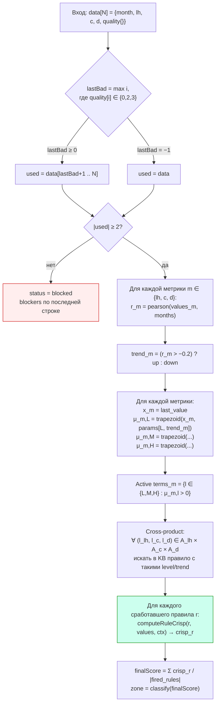
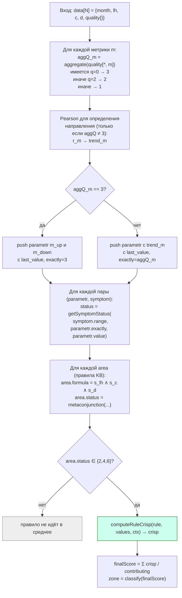
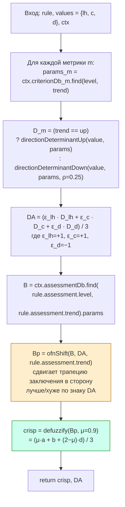
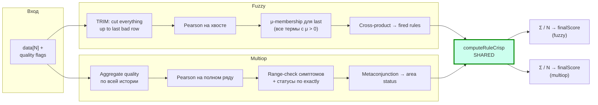

# Блок-схемы математических ядер двух ИС

Mermaid-диаграммы открываются на GitHub. Внизу — текстовое описание каждой
формулы.

---

## 1. Нечёткая логика (Fuzzy)



### Ключевые формулы

**Trapezoidal membership** (нормализованная по возрастанию):

```
trapezoid(x, [a, b, c, d]):
   если x ≤ a или x ≥ d  →  0
   если b ≤ x ≤ c        →  1
   если a < x < b        →  (x − a) / (b − a)
   если c < x < d        →  (d − x) / (d − c)
```

**Pearson correlation** (используется только для определения знака тренда,
не для значения):

```
r = Σ (t_i − t̄)(y_i − ȳ)  /  √( Σ(t_i − t̄)²  ·  Σ(y_i − ȳ)² )
```

Порог `-0.2` — асимметричный: даже слабо отрицательное r читается как down.

---

## 2. Теория мультиопераций (Multiop)



### Ключевые формулы

**getSymptomStatus(symptom_range = [start, end], exactly, value):**

```
exactly = 0 →  "0"   (источник не дал данных)
exactly = 1 →  value ∈ [start, end] ? "2" : "1"   (точные данные)
exactly = 2 →  value ∈ [start, end] ? "6" : "5"   (эксперт)
exactly = 3 →  "4"   (неопределённое направление)
```

**Метаконъюнкция (база)**:

```
       1   2   4
   1 | 1   1   1
   2 | 1   2   4
   4 | 1   4   4
```

Для составных статусов {3, 5, 6, 7} — операция через множества:
`setsArr["6"] = {"2","4"}`, и так далее. Результат — XOR-like объединение
базовых исходов (сумма уникальных кодов).

**Аггрегация финального балла:**

```
finalScore = Σ computeRuleCrisp(r) для r ∈ {area : status ∈ {2,4,6}}
             ─────────────────────────────────────────────────────────
                  |{area : status ∈ {2,4,6}}|
```

Status 5 (терм ложен по доступным данным) в среднее не идёт — это
«отбракованные» правила.

---

## 3. Общий хелпер `computeRuleCrisp` (shared)



### Формулы хелпера

**directionDeterminantUp(x, [a, b, _, c]):** число в [−1; +1],
показывающее положение `x` относительно пика `b`:

```
если a < x ≤ b  →  (x − b) / (b − a)   (отрицательное, чем дальше от пика)
если b < x < c  →  (x − b) / (c − b)   (положительное)
иначе           →  0
```

**directionDeterminantDown(x, [d, e, _, f], ρ=0.25):** аналогично, но
с компенсирующим сдвигом `−ρ` (потому что метрика «дефекты» направлена
противоположно).

**ofnShift(B = [k, l, _, m], DA, outTrend):**

```
abs = |DA|
target = (outTrend == up)
         ? (DA ≤ 0 ? toK : toM)
         : (DA ≤ 0 ? toM : toK)

Bp = [
    k + abs · (target[0] − k),
    l + abs · (target[1] − l),
    l + abs · (target[2] − l),
    m + abs · (target[3] − m),
]
```

Где `toK = [k, k, k, k]` (сдвиг к нижней границе), `toM = [m, m, m, m]`
(сдвиг к верхней).

**defuzzify(Bp = [a, b, _, d], μ=0.9):**

```
crisp = (μ·a + b + (2 − μ)·d) / 3
```

Это **взвешенный центроид** OFN при заданной горизонтальной отсечке `μ`.

---

## 4. Соединительная схема: чем системы отличаются на каждом шаге



---

## 5. Точки расхождения (где математика разная)

| Шаг | Fuzzy | Multiop |
|---|---|---|
| **Окно данных** | строго точный хвост `data[lastBad+1..]` | весь ряд `data[0..]` |
| **Pearson-окно** | по хвосту | по полному ряду |
| **Принадлежность level** | непрерывная μ ∈ [0; 1] (трапеция) | булева: `last_value ∈ symptom.range` |
| **Граничное значение** | в точке `x=b` (пик) μ=1, μ соседей могут быть 0 | range-проверки соседних диапазонов могут пересекаться → активируется больше уровней |
| **Реакция на эксперта** | блокируется, если эксперт в last | даёт status 5/6 |
| **Реакция на пропуск** | обрезает до точного хвоста | даёт status 4 |
| **Когда нет результата** | `used.length < 2` | `contributing == 0` (редко) |

## 6. Точки сходства (где математика одинаковая)

| Шаг | Где |
|---|---|
| **DA — совокупный определитель направления** | `(ε_lh · D_lh + ε_c · D_c + ε_d · D_d) / 3` |
| **OFN-сдвиг заключения** | `ofnShift(B, DA, trend)` |
| **Defuzzification** | `(μ·a + b + (2−μ)·d) / 3` |
| **Финальная агрегация** | среднее crisp по сработавшим правилам |
| **Зонирование** | `≤33.33 red`, `≤66.66 yellow`, `else green` |

Эти общие части вынесены в один хелпер `computeRuleCrisp` в
[server_system/src/calc/fuzzy/index.ts](../../../server_system/src/calc/fuzzy/index.ts).
